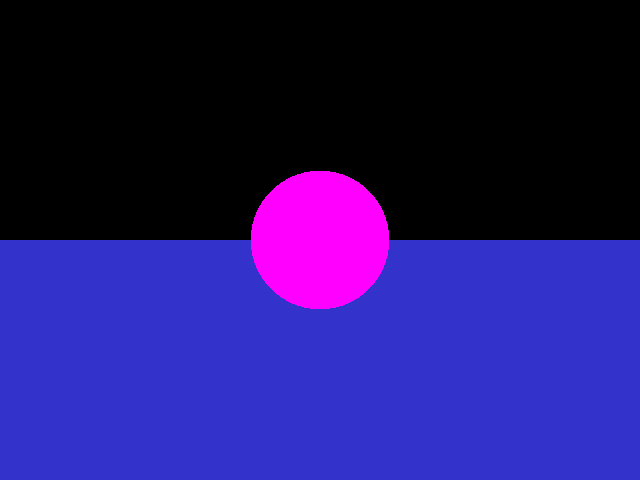

# Program 1 Input Files

Input files for [Part 1](http://iondune.github.io/csc473/project/part1/) of the [ray tracer project](http://iondune.github.io/csc473/project/).

| File      | Notes                                                                              |
|-----------|------------------------------------------------------------------------------------|
| test1     | pixelray command                                                                   |
| test2     | pixelray command                                                                   |
| test3     | pixelray command                                                                   |
| test4     | pixelray command                                                                   |
| test5     | pixelray command                                                                   |
| test6     | sceneinfo command (simple.pov)                                                     |
| test7     | sceneinfo command (spheres.pov)                                                    |
| test8     | sceneinfo command (planes.pov)                                                     |
| test9     | firsthit command (simple.pov), sphere                                              |
| test10    | firsthit command (simple.pov), plane                                               |
| test11    | firsthit command (simple.pov), no hit                                              |
| test12    | firsthit command (spheres.pov), white sphere                                       |
| test13    | firsthit command (spheres.pov), black sphere                                       |
| test14    | firsthit command (spheres.pov), grey sphere                                        |
| test15    | firsthit command (spheres.pov), blue sphere                                        |

## Output Images

### simple.pov

### spheres.pov

### planes.pov

