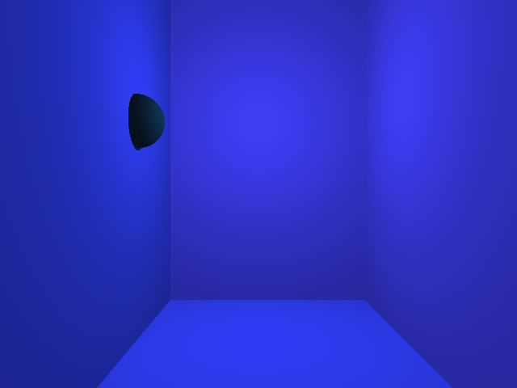
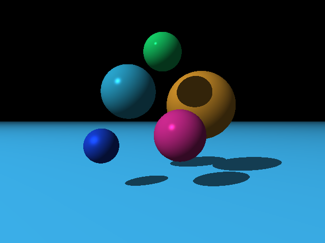

# Program 2 Input Files

Input files for [Part 2](http://iondune.github.io/csc473/project/part2/) of the [ray tracer project](http://iondune.github.io/csc473/project/).

| File      | Notes                                                                              |
|-----------|------------------------------------------------------------------------------------|
| test1     | pixelcolor command (simple.pov - purple sphere)                                      |
| test2     | pixelcolor command (simple.pov - purple sphere)                                      |
| test3     | pixelcolor command (simple.pov - blue plane)                                         |
| test4     | pixelcolor command (simple.pov - blue plane)                                         |

## Output Images

### simple.pov

### spheres.pov

### planes.pov

### specular.pov

### simp_cam0.pov

### simp_cam1.pov

### simp_cam2.pov

### simp_cam3.pov

