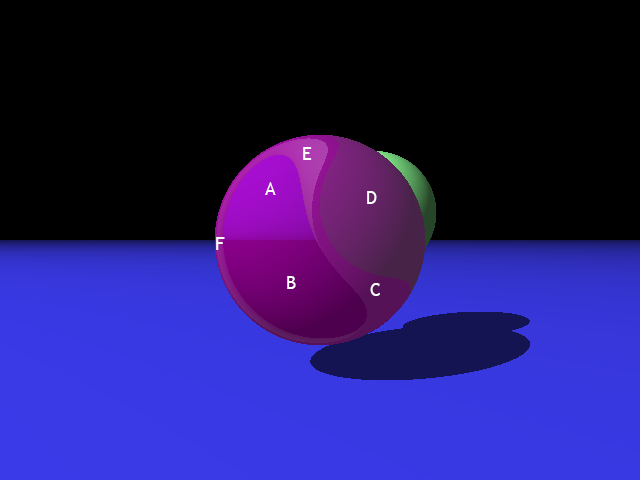
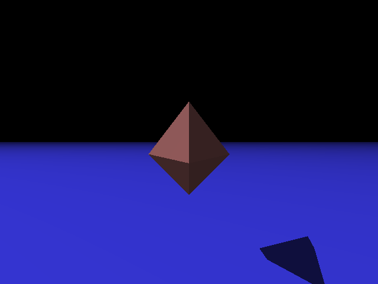
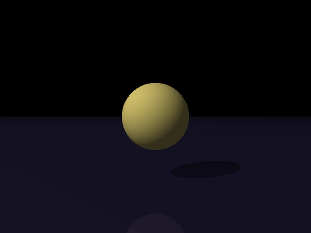
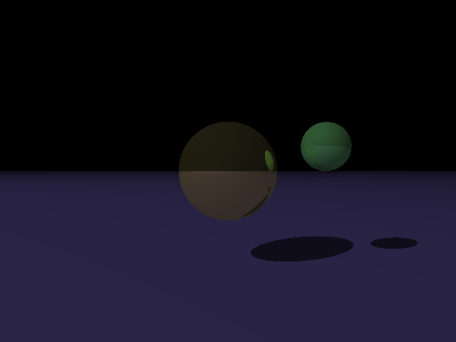
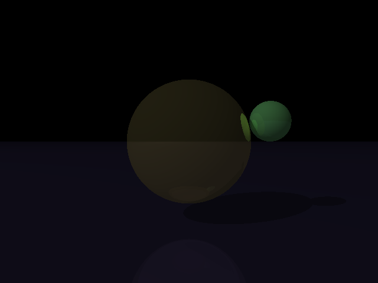
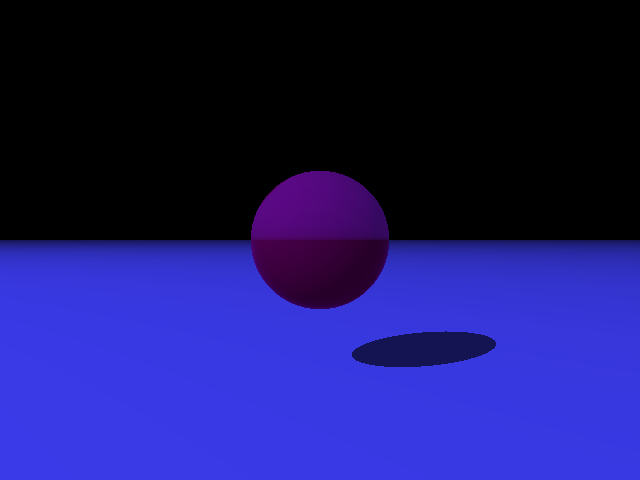
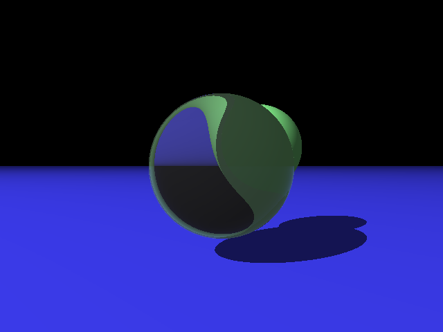
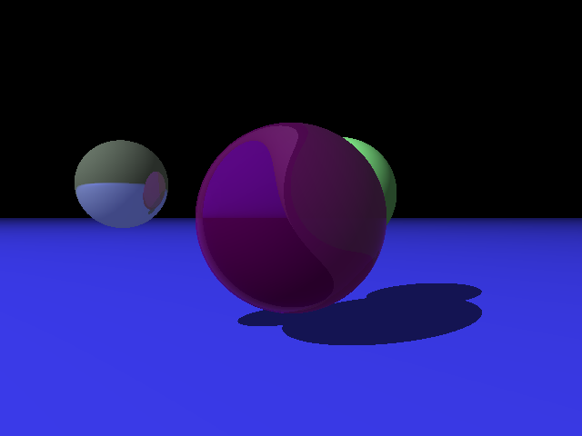
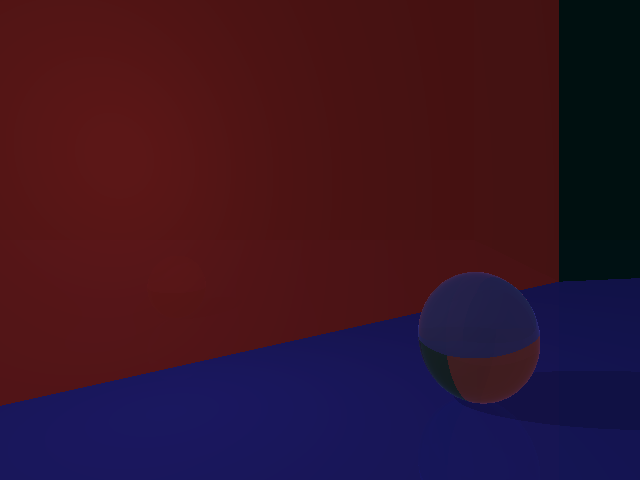
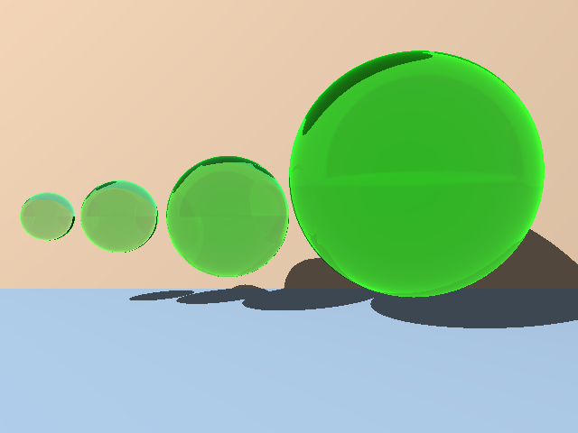

# Program 3 Input Files

Input files for [Part 3](http://iondune.github.io/csc473/project/part3) of the [ray tracer project](http://iondune.github.io/csc473/project/).

| File      | Notes                                                                              |
|-----------|------------------------------------------------------------------------------------|
| test1     | pixeltrace command (refract2.pov - pixel A)                                        |
| test2     | pixeltrace command (refract2.pov - pixel B)                                        |
| test3     | pixeltrace command (refract2.pov - pixel C)                                        |
| test4     | pixeltrace command (refract2.pov - pixel D)                                        |
| test5     | pixeltrace command (refract2.pov - pixel E)                                        |
| test6     | pixeltrace command (refract2.pov - pixel F)                                        |

### Reference Image

See below image for location of pixels A-F used in above tests.
Note that this image was rendering with different material properties, ignore the purple color of the sphere.
However, the geometry is the same.

## Output Images

### simple_tri.pov

### simple_reflect1.pov

### simple_reflect2.pov

### simple_reflect3.pov

### simple_refract.pov

### refract2.pov

### refract_refl.pov

### recurse_simp2.pov

### beers.pov

